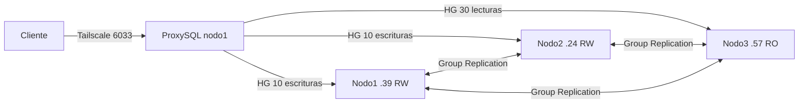

# Fase 1 — Guía operativa completa

## 0. Cómo utilizar esta guía

Esta guía permite reconstruir, comprobar y recuperar la Fase 1 sin depender de
una IA. No se ejecutan todos los comandos cada vez: primero se diagnostica y
después se utiliza solamente el procedimiento que corresponda al estado real.

Convenciones:

- Salvo que el encabezado indique otra cosa, los comandos `bash` los ejecuta
  **Byron en nodo1/Ubuntu**.
- Los bloques marcados para Michael se ejecutan en nodo2/Debian.
- Los comandos `powershell` los ejecuta **Carlos en nodo3/Windows**.
- Los bloques `sql` se ejecutan dentro del cliente MySQL.
- `ONLINE` es el resultado correcto para un miembro del grupo.
- `RECOVERING` es transitorio; se espera y se vuelve a consultar.
- Nunca se escriben contraseñas reales en este archivo.

Ruta rápida para no leer todo durante una emergencia:

| Necesidad | Sección |
|---|---:|
| Saber qué contraseña corresponde | 2 |
| Revisar todo después de encender | 3 y 4 |
| Saber si hacer JOIN o BOOTSTRAP | 7 |
| Revisar ProxySQL y hostgroups | 10 |
| Probar el acceso de la aplicación | 11 |
| Resolver `ERROR 1045` | 12 |
| Rotar una contraseña expuesta | 13 |
| Recuperarse después de un apagado | 14 |
| Identificar rápidamente un error | 15 |
| Preparar capturas para entregar | 17 |

## 1. Estado y arquitectura alcanzados

| Componente | Dirección | Función |
|---|---|---|
| Nodo1, Byron | `100.113.38.39:3306` | Lectura/escritura y bootstrap controlado |
| Nodo2, Michael | `100.126.57.24:3306` | Lectura/escritura |
| Nodo3, Carlos | `100.107.61.57:3306` | Lectura/contingencia |
| ProxySQL clientes | `100.113.38.39:6033` | Punto único de entrada |
| ProxySQL administración | `127.0.0.1:6032` | Administración solo desde nodo1 |

### ProxySQL o HAProxy

El proyecto está utilizando **ProxySQL**. HAProxy no está instalado ni forma
parte de la configuración actual.

ProxySQL fue elegido porque entiende el protocolo MySQL, mantiene usuarios,
monitoriza Group Replication y dirige consultas mediante hostgroups:

- HG 10: escritores nodo1 y nodo2.
- HG 30: lectores nodo1, nodo2 y nodo3.
- HG 40: miembros no viables u offline.

HAProxy trabaja principalmente como balanceador TCP. Podría repartir
conexiones, pero no sustituye las reglas SQL y hostgroups que ya se validaron.
No se deben mezclar ambos durante las pruebas actuales.

La IP `100.109.4.122` es el host de Michael. MySQL nodo2 comparte el espacio
de red del sidecar `tailscale-node2`, cuya IP de servicio es
`100.126.57.24`. La máquina `100.75.156.76` no pertenece al clúster.

Valores comunes:

```text
MySQL:               8.4
Group UUID:          c395e8af-d580-4d6c-8574-a629027f1379
Communication stack: MYSQL
Puerto del grupo:    3306
Modo:                multi-primary
Bootstrap normal:    OFF
Inicio automático:   OFF
```



Estado honesto de cierre:

- La infraestructura, Group Replication y el enrutamiento local funcionan.
- La conexión TCP remota a `6033` funciona.
- La autenticación remota con `app_user` funcionó y llegó a nodo3.
- La primera consulta encontró temporalmente `read_only=0`; la comprobación
  final devolvió `read_only=1`.
- ProxySQL confirmó nodo3 `ONLINE` únicamente en HG 30, con
  `read_only=YES`, `viable_candidate=YES`, atraso `0` y sin errores.
- La implementación funcional de la Fase 1 está en `100 %`.
- Antes de entregar todavía se deben rotar las credenciales expuestas y repetir
  una captura limpia usando `-p` sin colocar la contraseña en el comando.

## 1.1 Recorrido en el orden exacto del enunciado

Los responsables indicados facilitan la coordinación, pero todos deben conocer
y practicar los procedimientos. Pueden intercambiarse salvo cuando el comando
solo puede ejecutarse físicamente en el equipo que aloja el nodo.

### 1. Configurar tres nodos en entornos independientes

**Ejecutan: cada integrante en su computadora.**

```bash
docker compose ps
```

Sirve para: demostrar que cada nodo se ejecuta en un host independiente.

Resultado esperado: `mysql-node1`, `mysql-node2` y `mysql-nodo3` saludables en
sus respectivos equipos.

> **CAPTURA F1-01:** cada integrante captura su `docker compose ps`; Carlos
> reúne las tres imágenes.

### 2. Configurar comunicación mediante red privada

**Ejecutan: los tres.**

```bash
tailscale ip -4
tailscale status
tailscale ping IP_DEL_OTRO_NODO
```

Sirve para: demostrar que las máquinas se comunican por Tailscale y no por
puertos públicos de Internet.

> **CAPTURA F1-02:** Byron captura `tailscale status` con `.39`, `.24` y `.57`.

### 3. Configurar el mecanismo de replicación

**Ejecuta: Byron. Observan: Michael y Carlos.**

```bash
docker exec mysql-node1 sh -c 'mysql -uroot -p"$MYSQL_ROOT_PASSWORD" -e "
SELECT MEMBER_HOST,MEMBER_PORT,MEMBER_STATE,MEMBER_ROLE
FROM performance_schema.replication_group_members;
"'
```

Sirve para: demostrar Group Replication y la membresía distribuida.

> **CAPTURA F1-03:** consulta completa con los tres miembros `ONLINE`.

### 4. Configurar nodo1 y nodo2 para lectura/escritura

**Ejecutan: Byron en nodo1 y Michael en nodo2.**

```sql
SELECT @@report_host, @@global.read_only, @@global.super_read_only;
```

Resultado esperado en nodo1 y nodo2: `read_only=0` y
`super_read_only=0`.

> **CAPTURA F1-04:** ambas terminales o resultados identificados por IP.

### 5. Configurar nodo3 como lectura y contingencia

**Ejecuta: Carlos.**

```sql
SET GLOBAL super_read_only=ON;
SELECT @@report_host, @@global.read_only, @@global.super_read_only;
```

Resultado esperado: `.57`, `1`, `1`. Una escritura directa debe devolver
`ERROR 1290`.

> **CAPTURAS F1-05 y F1-06:** estado `1/1` y rechazo de escritura.

### 6. Integrar proxy o balanceador

**Ejecuta: Byron. Observa: Michael.**

```bash
cd proxy
docker compose ps
```

Resultado esperado: `proxysql-db2` saludable. Este proyecto usa ProxySQL, no
HAProxy. La inspección detallada de hostgroups está en la sección 10.

> **CAPTURA F1-07:** ProxySQL saludable y hostgroups 10/30 activos.

### 7. Verificar conectividad entre componentes

**Byron comprueba MySQL:**

```bash
nc -vz -w 5 100.126.57.24 3306
nc -vz -w 5 100.107.61.57 3306
```

**Carlos comprueba ProxySQL:**

```powershell
Test-NetConnection 100.113.38.39 -Port 6033
```

Resultado esperado: conexiones exitosas.

> **CAPTURA F1-08:** puertos 3306 y 6033 accesibles sin mostrar secretos.

### 8. Comprobar que los tres nodos estén disponibles

Se repite la consulta de membresía del punto 3 y se comprueban los tres
contenedores. No basta con `docker ps`: cada miembro debe decir `ONLINE`.

> **CAPTURA F1-09:** estado final de los tres miembros y diagrama de la sección
> 1. Estas imágenes se incorporan al informe final y también se conservan en la
> carpeta de evidencias del proyecto.

## 2. Mapa de credenciales: cuál usar y cuándo

| Credencial | Para qué sirve | Dónde se conserva | Frecuencia |
|---|---|---|---|
| Root MySQL nodo1 | Administración local de nodo1 | `nodes/node1/.env` | Diagnóstico y configuración |
| Root MySQL nodo2 | Administración local de nodo2 | `nodes/node2/.env` | Diagnóstico local |
| Root MySQL nodo3 | Administración local de nodo3 | `.env` privado de Carlos | Diagnóstico local |
| `repl` | Recuperación de Group Replication | Canal interno de los tres MySQL | Casi nunca se escribe manualmente |
| `proxysql_monitor` | ProxySQL consulta salud y roles | SQL privados del directorio `proxy/` | Automática; no se entrega al grupo |
| `app_user` | Clientes entran por el puerto `6033` | SQL privados del directorio `proxy/` | Pruebas y aplicación |
| Admin de ProxySQL | Cambiar servidores, usuarios y reglas | `proxy/conf/proxysql.cnf` | Solo Byron, puerto `6032` |
| `TS_AUTHKEY` | Registrar el sidecar Tailscale de nodo2 | `nodes/node2/.env` | Solo si Tailscale pierde la sesión |

Reglas para no confundirse:

1. Para conectarse como cliente a `6033`, siempre se usa `app_user`.
2. `proxysql_monitor` no se entrega a Carlos ni Michael.
3. La cuenta administrativa de ProxySQL no es `app_user` y no entra por 6033.
4. Para root dentro de un contenedor se usa la variable ya cargada:

   ```bash
   docker exec mysql-node1 sh -c 'mysql -uroot -p"$MYSQL_ROOT_PASSWORD"'
   ```

5. Para una contraseña interactiva se usa `-p` sin escribir el valor al lado.
6. Los secretos reales se guardan en un gestor cifrado de contraseñas. En el
   repositorio solo se conserva su ubicación y finalidad.
7. Una contraseña recordable debe ser una frase larga y única, por ejemplo
   cuatro palabras no relacionadas con separadores y números. No utilizar
   nombres del grupo, cursos, fechas de entrega ni ejemplos de esta guía.

Archivos privados que Git debe ignorar:

```bash
git check-ignore -v nodes/node1/.env nodes/node2/.env \
  proxy/conf/proxysql.cnf proxy/sql/mysql-users.sql \
  proxy/sql/proxysql-admin.sql
```

Qué demuestra: evita subir credenciales al repositorio.

Resultado esperado: una regla de `.gitignore` para cada archivo.

## A. Construcción cronológica desde cero por integrante

Esta sección resume el camino real seguido por el equipo. Las secciones
posteriores contienen los diagnósticos y recuperaciones detallados.

### A.1 Centralizar el tailnet

**Ejecutan: Byron, Michael y Carlos, cada uno en su host.**

Los tres equipos deben iniciar sesión en el mismo tailnet. Después cada uno
ejecuta:

```bash
tailscale ip -4
tailscale status
```

En Windows, Carlos puede usar los mismos comandos desde PowerShell.

Sirve para: confirmar la IP privada propia y que los otros integrantes aparecen
como pares. El equipo `100.75.156.76` se descartó porque no forma parte del
clúster definitivo.

Direcciones acordadas:

```text
nodo1: 100.113.38.39
nodo2: 100.126.57.24
nodo3: 100.107.61.57
```

### A.2 Preparar nodo1 en Ubuntu

**Ejecuta: Byron en nodo1.**

```bash
docker --version
docker compose version
tailscale ip -4
sudo ss -lntp | grep -E ':3306|:6032|:6033' || true
```

Sirve para: comprobar herramientas, IP y posibles conflictos de puertos.

Desde `nodes/node1/`:

```bash
docker compose config --quiet
docker compose up -d --force-recreate mysql-node1
docker compose ps
docker logs mysql-node1 --tail 50
```

Sirve para: validar el Compose, iniciar MySQL con `conf/my.cnf` y confirmar que
queda `healthy`. El `.env` local proporciona `MYSQL_ROOT_PASSWORD` y nunca se
sube a Git.

### A.3 Diagnóstico original de nodo2 con Docker Desktop

**Ejecuta: Michael en Debian.**

Se confirmó qué motor Docker estaba utilizando:

```bash
docker context show
docker info --format '{{.OperatingSystem}}'
docker context ls
docker --context default info --format '{{.OperatingSystem}}'
```

Resultado observado:

```text
contexto activo: desktop-linux
sistema Docker:  Docker Desktop
contexto default: daemon/sock no disponible
```

Sirve para: explicar por qué `network_mode: host` dentro de Docker Desktop no
veía directamente la IP Tailscale del host Debian.

También se auditó el sistema sin modificarlo:

```bash
cat /etc/os-release
apt-cache policy libc6 libseccomp2
grep -R --line-number -E '^(deb |Suites:)' /etc/apt/sources.list /etc/apt/sources.list.d 2>/dev/null
apt-get --simulate install docker-ce containerd.io
```

Se encontró una mezcla entre paquetes `trixie/sid` y fuentes `bookworm`, y la
simulación reportó conflicto de `libseccomp2`. Para no arriesgar documentos ni
proyectos de Michael, no se cambiaron repositorios ni se instaló otro daemon.

### A.4 Solución segura para nodo2: sidecar Tailscale

**Ejecuta: Michael en Debian/Docker Desktop.**

Primero se confirmó que Docker Desktop podía usar TUN:

```bash
docker run --rm --device /dev/net/tun:/dev/net/tun alpine:3.20 ls -l /dev/net/tun
```

Resultado esperado: dispositivo de caracteres `/dev/net/tun` visible.

Después se creó `tailscale-node2` con:

- capacidades `NET_ADMIN` y `NET_RAW`;
- dispositivo `/dev/net/tun`;
- volumen persistente `tailscale_node2_state`;
- clave privada `TS_AUTHKEY` en `.env`;
- `mysql-node2` usando `network_mode: service:tailscale-node2`.

Antes de iniciar:

```bash
git check-ignore -v .env
docker compose config --quiet
docker compose up -d tailscale-node2
docker exec tailscale-node2 tailscale ip -4
docker exec tailscale-node2 tailscale status
```

Sirve para: crear una interfaz Tailscale dentro del espacio de red que comparte
MySQL. Resultado definitivo: `100.126.57.24`.

Luego se inicia MySQL:

```bash
docker compose up -d --force-recreate mysql-node2
docker compose ps
docker logs mysql-node2 --tail 50
```

### A.5 Problema de permisos del directorio de datos de nodo2

**Diagnostica y corrige: Michael.**

El bind mount `./data:/var/lib/mysql` produjo:

```text
chown: changing ownership of '/var/lib/mysql/mysql.sock': Operation not permitted
```

No se solucionó con `chmod 777` ni borrando datos. Se reemplazó por el volumen
nombrado `mysql_node2_data`.

Comprobación:

```bash
docker inspect -f '{{range .Mounts}}{{.Type}} {{.Name}} -> {{.Destination}}{{println}}{{end}}' mysql-node2
```

Resultado esperado:

```text
volume node2_mysql_node2_data -> /var/lib/mysql
bind -> /etc/mysql/conf.d/my.cnf
```

Sirve para: verificar persistencia administrada por Docker y configuración
montada como archivo. Nunca ejecutar `rm -rf data/*` ni eliminar el volumen.

### A.6 Crash XCOM de nodo2 y cambio a pila MYSQL

**Diagnostica: Michael. Configuración coordinada por todo el equipo.**

El primer intento con XCOM y la IP del host provocó pérdida de conexión y:

```text
buffer overflow detected
mysqld got signal 6
```

Comandos utilizados:

```bash
docker logs mysql-node2 --since 15m 2>&1 | grep -E 'buffer overflow|signal 6|certifier|GCS|ERROR'
docker exec mysql-node2 sh -c 'mysql -uroot -p"$MYSQL_ROOT_PASSWORD" -N -e "SELECT VERSION(), @@group_replication_communication_stack;"'
```

Sirve para: diferenciar el crash real de advertencias no fatales como
`relay-log`.

La solución estable fue configurar en los tres nodos:

```text
loose-group_replication_communication_stack = MYSQL
local_address = IP_TAILSCALE:3306
group_seeds = nodo1:3306,nodo2:3306,nodo3:3306
```

Con la pila `MYSQL`, el puerto de comunicación del grupo es el mismo `3306` y
se eliminó la dependencia problemática de XCOM/33061.

### A.7 Preparar nodo3 en Windows

**Ejecuta: Carlos en PowerShell.**

Comprobar configuración persistente:

```powershell
Get-Content .\nodos\nodo3\conf\my.cnf | Select-String 'communication_stack|local_address|group_seeds'
```

Resultado esperado:

```text
communication_stack = MYSQL
local_address = 100.107.61.57:3306
group_seeds = 100.113.38.39:3306,100.126.57.24:3306,100.107.61.57:3306
```

Comprobar estado y canal recovery:

```powershell
docker exec -it mysql-nodo3 mysql -uroot -p -e "SELECT @@global.gtid_executed; SELECT MEMBER_HOST,MEMBER_STATE FROM performance_schema.replication_group_members; SELECT CHANNEL_NAME,USER FROM performance_schema.replication_connection_configuration WHERE CHANNEL_NAME='group_replication_recovery';"
```

Sirve para: conocer GTID, membresía y usuario recovery antes de unir el nodo.
La contraseña root se introduce en el prompt; no se pega en el comando.

Después de que nodo1 ya creó el grupo, Carlos ejecuta dentro de MySQL:

```sql
START GROUP_REPLICATION;
SELECT MEMBER_HOST, MEMBER_PORT, MEMBER_STATE, MEMBER_ROLE
FROM performance_schema.replication_group_members;
```

Finalmente protege nodo3:

```sql
SET GLOBAL super_read_only=ON;
SELECT @@global.read_only, @@global.super_read_only;
```

### A.8 Orden final de arranque del equipo

1. **Byron:** comprueba red y forma el grupo solo si todos están `OFFLINE`.
2. **Michael:** une nodo2 con `START GROUP_REPLICATION`.
3. **Carlos:** une nodo3 con `START GROUP_REPLICATION` y activa
   `super_read_only=ON`.
4. **Byron:** confirma tres `ONLINE` y después inicia/valida ProxySQL.
5. **Carlos:** prueba el cliente remoto por `100.113.38.39:6033`.

Si nodo2 o nodo3 ya mantienen un grupo `ONLINE`, Byron no hace bootstrap:
nodo1 solamente ejecuta `START GROUP_REPLICATION`.

## 3. Diagnóstico inicial de cualquier sesión

### 3.1 Revisar repositorio sin modificarlo

```bash
git status --short --branch
```

Qué demuestra: rama actual y archivos locales pendientes. No resuelve ni
descarta cambios.

### 3.2 Revisar Docker y Tailscale en nodo1

```bash
docker ps -a --format 'table {{.Names}}\t{{.Status}}\t{{.Image}}'
tailscale ip -4
tailscale status
```

Resultado esperado:

```text
mysql-node1   Up ... (healthy)
proxysql-db2  Up ... (healthy)
100.113.38.39
```

### 3.3 Saber si un contenedor se reinició o falló

```bash
docker inspect -f '{{.Name}} estado={{.State.Status}} reinicios={{.RestartCount}} salida={{.State.ExitCode}} error={{.State.Error}}' mysql-node1 proxysql-db2
```

Qué demuestra: diferencia un apagado del host, un reinicio automático y un
contenedor que está fallando repetidamente.

Resultado normal: `estado=running`, `salida=0` y pocos o cero reinicios.

## 4. Comprobar la red antes de tocar MySQL

### 4.1 Desde nodo1

```bash
tailscale ping 100.126.57.24
tailscale ping 100.107.61.57
nc -vz -w 5 100.126.57.24 3306
nc -vz -w 5 100.107.61.57 3306
```

Interpretación:

| Resultado | Significado probable |
|---|---|
| `pong` | El par Tailscale está disponible |
| `succeeded` | Hay un servicio escuchando en el puerto |
| `Connection refused` | La máquina responde, pero el servicio/puerto no escucha |
| `timed out` | Equipo apagado, Tailscale desconectado, firewall o ruta bloqueada |
| `no matching peer` | La IP no pertenece al tailnet actual |

No se hace bootstrap ni se cambia `my.cnf` para resolver un problema de red.

### 4.2 Desde Carlos/Windows

```powershell
Test-NetConnection 100.113.38.39 -Port 6033
```

Resultado esperado:

```text
InterfaceAlias   : Tailscale
TcpTestSucceeded : True
```

Esto solo prueba TCP. Todavía no prueba usuario ni contraseña.

## 5. Comprobar MySQL y su configuración efectiva

### 5.1 Estado y log local

```bash
docker compose ps
docker logs mysql-node1 --tail 50
```

En nodo2 se cambia el nombre a `mysql-node2`; en nodo3 a `mysql-nodo3`.

Resultado esperado: `healthy`, puerto 3306 y ausencia de errores fatales.

### 5.2 Valores que realmente cargó MySQL

En nodo1:

```bash
docker exec mysql-node1 sh -c 'mysql -uroot -p"$MYSQL_ROOT_PASSWORD" -e "
SELECT
  @@server_id,
  @@report_host,
  @@gtid_mode,
  @@group_replication_group_name,
  @@group_replication_communication_stack,
  @@group_replication_local_address,
  @@group_replication_group_seeds,
  @@group_replication_single_primary_mode,
  @@group_replication_enforce_update_everywhere_checks;
"'
```

Valores esperados:

- `server_id`: 1, 2 y 3, uno diferente por nodo.
- `gtid_mode`: `ON`.
- Mismo UUID en los tres.
- Pila: `MYSQL`.
- Direcciones locales `.39`, `.24` y `.57` sobre `3306`.
- Semillas: `.39:3306,.24:3306,.57:3306`.
- `single_primary_mode=0` y `enforce_update_everywhere_checks=1`.

El archivo `my.cnf` puede verse correcto y no estar cargado. Esta consulta
comprueba el valor efectivo del servidor.

## 6. Usuario de recuperación y canal interno

### 6.1 Comprobar cuenta y permisos

```sql
SELECT User, Host, plugin FROM mysql.user WHERE User='repl';
SHOW GRANTS FOR 'repl'@'%';
```

Permisos requeridos:

```text
REPLICATION SLAVE
BACKUP_ADMIN
CONNECTION_ADMIN
GROUP_REPLICATION_STREAM
```

### 6.2 Comprobar canal

```sql
SELECT CHANNEL_NAME, USER
FROM performance_schema.replication_connection_configuration
WHERE CHANNEL_NAME='group_replication_recovery';

SELECT @@group_replication_recovery_get_public_key;
```

Resultado esperado:

```text
group_replication_recovery | repl
recovery_get_public_key    | 1
```

Si el canal ya muestra `repl`, no se repite `CHANGE REPLICATION SOURCE`.
El error 3139 normalmente indica que se intentó cambiar un canal que el plugin
ya está utilizando o configurando; primero se consulta, no se insiste.

## 7. Decidir entre JOIN y BOOTSTRAP

Primero se consulta el grupo:

```bash
docker exec mysql-node1 sh -c 'mysql -uroot -p"$MYSQL_ROOT_PASSWORD" -e "
SELECT MEMBER_HOST, MEMBER_PORT, MEMBER_STATE, MEMBER_ROLE
FROM performance_schema.replication_group_members;
"'
```

### Caso A: existe al menos un miembro `ONLINE`

No se hace bootstrap. En el nodo que esté `OFFLINE`:

```sql
START GROUP_REPLICATION;
```

Después:

```sql
SELECT MEMBER_HOST, MEMBER_PORT, MEMBER_STATE, MEMBER_ROLE
FROM performance_schema.replication_group_members;
```

### Caso B: todos los nodos están `OFFLINE`

Antes de iniciar se comparan los GTID en cada host:

```bash
docker exec NOMBRE_CONTENEDOR sh -c 'mysql -uroot -p"$MYSQL_ROOT_PASSWORD" -N -e "SELECT @@global.gtid_executed;"'
```

Se elige el nodo con el conjunto GTID más completo. Si coinciden, se usa nodo1.
Solamente ese nodo ejecuta:

```bash
docker exec mysql-node1 sh -c '
mysql -uroot -p"$MYSQL_ROOT_PASSWORD" -e "SET GLOBAL group_replication_bootstrap_group=ON;"
mysql -uroot -p"$MYSQL_ROOT_PASSWORD" -e "START GROUP_REPLICATION;"
cmd_rc=$?
mysql -uroot -p"$MYSQL_ROOT_PASSWORD" -e "SET GLOBAL group_replication_bootstrap_group=OFF;"
mysql -uroot -p"$MYSQL_ROOT_PASSWORD" -e "
SELECT @@global.group_replication_bootstrap_group AS bootstrap;
SELECT MEMBER_HOST, MEMBER_PORT, MEMBER_STATE, MEMBER_ROLE
FROM performance_schema.replication_group_members;
"
exit "$cmd_rc"
'
```

Resultado seguro: `bootstrap=0` y un miembro `ONLINE`. Nodo2 y nodo3 se unen
después con `START GROUP_REPLICATION`, sin bootstrap.

Regla de oro: bootstrap crea un grupo nuevo; `START GROUP_REPLICATION` se une
a uno existente. Dos bootstrap pueden producir dos grupos separados.

## 8. Verificación final del grupo y protección de nodo3

Estado esperado:

```text
100.113.38.39  3306  ONLINE  PRIMARY
100.126.57.24  3306  ONLINE  PRIMARY
100.107.61.57  3306  ONLINE  PRIMARY
```

Los tres dicen `PRIMARY` porque el grupo es multi-primary. La protección
operativa de nodo3 se comprueba aparte:

```sql
SET GLOBAL super_read_only=ON;
SELECT @@global.read_only, @@global.super_read_only;
```

Resultado: `1` y `1`.

Prueba negativa en nodo3:

```sql
CREATE DATABASE prueba_no_escritura_nodo3;
```

Resultado correcto:

```text
ERROR 1290: The MySQL server is running with the --super-read-only option
```

## 9. Instalación y comprobación de ProxySQL

### 9.1 Confirmar puertos libres antes del primer arranque

```bash
sudo ss -lntp | grep -E ':6032|:6033' || echo 'Puertos 6032 y 6033 libres'
```

### 9.2 Validar configuración y arrancar

```bash
cd proxy
docker compose config --quiet
docker compose up -d
docker compose ps
docker logs proxysql-db2 --tail 50
```

Resultado esperado: `proxysql-db2` en estado `healthy`.

El volumen `proxy_proxysql_data` mantiene la configuración. No se elimina para
resolver un problema de autenticación.

### 9.3 Crear cuentas MySQL del proxy

El archivo privado contiene las contraseñas; el comando no las imprime:

```bash
docker exec -i mysql-node1 sh -c 'mysql -uroot -p"$MYSQL_ROOT_PASSWORD"' \
  < proxy/sql/mysql-users.sql
```

Permisos mínimos:

- `proxysql_monitor`: `REPLICATION CLIENT` y lectura de las tablas necesarias
  de `performance_schema`.
- `app_user`: `SELECT`, `INSERT`, `UPDATE` y `DELETE` sobre `data_bugs.*`.

Permisos adicionales que MySQL 8.4 necesitó para el monitor:

```bash
docker exec -i mysql-node1 sh -c 'mysql -uroot -p"$MYSQL_ROOT_PASSWORD"' \
  < proxy/sql/monitor-grants.sql.example
```

Sin esos permisos ProxySQL mueve preventivamente los servidores al HG 40 y su
log muestra `SELECT command denied` sobre `replication_group_members`.

### 9.4 Cargar la configuración administrativa sin mostrar la clave

Desde la raíz del repositorio:

```bash
admin_pair=$(sed -n 's/^[[:space:]]*admin_credentials="\([^"]*\)".*/\1/p' proxy/conf/proxysql.cnf | head -n1)
proxy_admin_user=${admin_pair%%:*}
proxy_admin_pass=${admin_pair#*:}

docker exec -i \
  -e MYSQL_PWD="$proxy_admin_pass" \
  mysql-node1 \
  mysql -h127.0.0.1 -P6032 -u"$proxy_admin_user" \
  < proxy/sql/proxysql-admin.sql

cmd_rc=$?
unset admin_pair proxy_admin_user proxy_admin_pass
echo "resultado=$cmd_rc"
```

Resultado esperado: `resultado=0`.

No usar la variable `status` en zsh porque es de solo lectura; se usa `cmd_rc`.

## 10. Inspección avanzada de ProxySQL

Estos son los comandos administrativos utilizados durante el diagnóstico. Son
de solo lectura.

```bash
admin_pair=$(sed -n 's/^[[:space:]]*admin_credentials="\([^"]*\)".*/\1/p' proxy/conf/proxysql.cnf | head -n1)
proxy_admin_user=${admin_pair%%:*}
proxy_admin_pass=${admin_pair#*:}

docker exec -e MYSQL_PWD="$proxy_admin_pass" mysql-node1 \
  mysql -h127.0.0.1 -P6032 -u"$proxy_admin_user" -e "
SELECT hostgroup_id, hostname, port, status
FROM runtime_mysql_servers
ORDER BY hostgroup_id, hostname;

SELECT username, active, default_hostgroup, default_schema, frontend, backend
FROM runtime_mysql_users
WHERE username='app_user';

SELECT hostgroup, srv_host, srv_port, status, ConnUsed, ConnFree, Queries
FROM stats_mysql_connection_pool
ORDER BY hostgroup, srv_host;
"

unset admin_pair proxy_admin_user proxy_admin_pass
```

Distribución esperada:

```text
HG 10: nodo1 y nodo2 como escritores
HG 30: nodo1, nodo2 y nodo3 como lectores
HG 40: únicamente miembros no viables/offline
app_user: active=1, default_hostgroup=10
```

Logs útiles:

```bash
docker logs proxysql-db2 --since 15m 2>&1 | tail -n 100
```

## 11. Pruebas de enrutamiento

### 11.1 Lectura local por ProxySQL

No se escribe la contraseña en el comando:

```bash
read -s 'app_password?Contraseña de app_user: '
echo
docker exec -e MYSQL_PWD="$app_password" mysql-node1 \
  mysql -h127.0.0.1 -P6033 -uapp_user -Ddata_bugs -e "
SELECT @@report_host AS backend,
       @@server_id AS server_id,
       @@global.read_only AS read_only,
       @@global.super_read_only AS super_read_only;
"
unset app_password
```

Qué demuestra: autenticación de la aplicación y envío de `SELECT` al HG 30.

### 11.2 Consulta con bloqueo hacia escritores

```sql
START TRANSACTION;
SELECT @@report_host, @@server_id, @@global.read_only FOR UPDATE;
ROLLBACK;
```

Qué demuestra: la regla `SELECT ... FOR UPDATE` usa HG 10. `ROLLBACK` evita
cambios de datos.

### 11.3 Cliente remoto Carlos/Windows

```powershell
docker exec -it mysql-nodo3 mysql -h100.113.38.39 -P6033 -uapp_user -p -Ddata_bugs -e "SELECT @@report_host AS backend, @@server_id AS server_id, @@global.read_only AS read_only;"
```

Carlos debe introducir la contraseña del bloque `app_user`, no la primera
contraseña que encuentre en `mysql-users.sql`. La contraseña se pega en el
prompt `Enter password:`; nunca se usa `-pCONTRASEÑA`.

Un backend `.39`, `.24` o `.57` es válido para un `SELECT` si aparece saludable
en HG 30.

Resultado remoto obtenido con la credencial correcta:

```text
backend          server_id  read_only
100.107.61.57    3          0
```

Esto confirmó red, autenticación y enrutamiento hasta nodo3. El `0` no era el
resultado deseado para contingencia. El comando directo mostrado después por
Carlos contenía únicamente un `SELECT`; un `SELECT` no puede cambiar
`read_only`. Para restaurar el rol de forma determinista se ejecuta en nodo3:

```sql
SET GLOBAL super_read_only=ON;
SELECT @@global.read_only, @@global.super_read_only;
```

Activar `super_read_only` también activa `read_only`. Este paso debe repetirse
después de cada reinicio o reincorporación de nodo3 porque Group Replication en
modo multi-primary puede volver a habilitar escrituras al unir un miembro.

La comprobación remota final mostró:

```text
backend          server_id  read_only
100.107.61.57    3          1
```

Desde nodo1 se confirmó además que ProxySQL mantiene nodo3 `ONLINE` únicamente
en HG 30. Su monitor informó `read_only=YES`, `viable_candidate=YES`, retraso
`0` y `error=NULL`.

La prueba funcional está completa. La captura compartida no se utiliza en el
informe porque incluyó la contraseña después de `-p`; después de rotarla se
repite el mismo comando usando solamente `-p` y el prompt interactivo.

## 12. Diagnóstico del `ERROR 1045` de `app_user`

El mensaje:

```text
ProxySQL Error: Access denied for user 'app_user'
```

demuestra que red y puerto funcionan: la solicitud llegó al proxy. El problema
está en usuario/contraseña o en `runtime_mysql_users`.

### 12.1 Comprobar igualdad sin imprimir secretos

El siguiente bloque compara los archivos privados, runtime y autenticación. No
muestra ninguna contraseña:

```bash
mysql_app=$(sed -n "/ALTER USER 'app_user'/,+2{s/.*BY '\([^']*\)'.*/\1/p;}" proxy/sql/mysql-users.sql | head -n1)
proxy_app=$(sed -n "/('app_user',/s/.*('app_user', '\([^']*\)'.*/\1/p" proxy/sql/proxysql-admin.sql | head -n1)

admin_pair=$(sed -n 's/^[[:space:]]*admin_credentials="\([^"]*\)".*/\1/p' proxy/conf/proxysql.cnf | head -n1)
proxy_admin_user=${admin_pair%%:*}
proxy_admin_pass=${admin_pair#*:}

runtime_row=$(docker exec -e MYSQL_PWD="$proxy_admin_pass" mysql-node1 \
  mysql -h127.0.0.1 -P6032 -u"$proxy_admin_user" -N -e \
  "SELECT password,default_hostgroup,active FROM runtime_mysql_users WHERE username='app_user' AND frontend=1 LIMIT 1;" 2>/dev/null)

runtime_app=$(printf '%s\n' "$runtime_row" | awk '{print $1}')
runtime_hg=$(printf '%s\n' "$runtime_row" | awk '{print $2}')
runtime_active=$(printf '%s\n' "$runtime_row" | awk '{print $3}')

[ "$mysql_app" = "$proxy_app" ] && echo 'archivos: COINCIDEN' || echo 'archivos: NO COINCIDEN'
[ "$proxy_app" = "$runtime_app" ] && echo 'runtime: COINCIDE' || echo 'runtime: NO COINCIDE'
echo "hostgroup=$runtime_hg active=$runtime_active"

docker exec -e MYSQL_PWD="$mysql_app" mysql-node1 \
  mysql -h100.113.38.39 -P3306 -uapp_user -N -e 'SELECT 1' >/dev/null 2>&1 \
  && echo 'MySQL directo: OK' || echo 'MySQL directo: FALLA'

docker exec -e MYSQL_PWD="$mysql_app" mysql-node1 \
  mysql -h127.0.0.1 -P6033 -uapp_user -N -e 'SELECT 1' >/dev/null 2>&1 \
  && echo 'ProxySQL: OK' || echo 'ProxySQL: FALLA'

unset mysql_app proxy_app admin_pair proxy_admin_user proxy_admin_pass \
  runtime_row runtime_app runtime_hg runtime_active
```

Resultado obtenido durante el diagnóstico:

```text
archivos: COINCIDEN
runtime: COINCIDE
hostgroup=10 active=1
MySQL directo: OK
ProxySQL: OK
```

Conclusión: Carlos utilizó la contraseña de otra cuenta. No hacía falta crear
de nuevo `app_user` ni cambiar su hostgroup.

No ejecutar una solución que inserte `default_hostgroup=1`: este proyecto usa
HG 10 para escritores. Tampoco usar `admin/admin`; la cuenta administrativa
real fue rotada.

## 13. Rotación de credenciales expuestas

Si una contraseña aparece en chat, captura, historial o archivo rastreado, se
considera comprometida aunque todavía funcione.

Orden seguro:

1. Crear frases distintas para `proxysql_monitor`, `app_user` y el root de
   nodo3, porque esas credenciales aparecieron durante el diagnóstico.
2. Actualizar las dos apariciones de cada cuenta en
   `proxy/sql/mysql-users.sql`.
3. Actualizar los mismos valores en `proxy/sql/proxysql-admin.sql`.
4. Confirmar que ambos archivos están ignorados con `git check-ignore -v`.
5. Aplicar cuentas MySQL:

   ```bash
   docker exec -i mysql-node1 sh -c 'mysql -uroot -p"$MYSQL_ROOT_PASSWORD"' \
     < proxy/sql/mysql-users.sql
   ```

6. Aplicar configuración de ProxySQL usando el bloque administrativo de la
   sección 9.4.
7. Ejecutar la comparación segura de la sección 12.1.
8. Revisar hostgroups y logs durante al menos dos ciclos de monitoreo.
9. Enviar únicamente la nueva contraseña de `app_user` a Carlos por privado.

Carlos rota su root desde una sesión MySQL interactiva:

```sql
ALTER USER 'root'@'localhost' IDENTIFIED BY 'NUEVA_FRASE_PRIVADA';
```

Después actualiza su `.env` privado con el mismo valor. No escribe la frase en
PowerShell, capturas ni archivos rastreados por Git.

No se borran volúmenes ni se recrea el clúster para rotar una contraseña.

## 14. Recuperación después de apagar una computadora

### 14.1 Diagnóstico utilizado después del apagado de nodo1

```bash
docker ps -a --format 'table {{.Names}}\t{{.Status}}\t{{.Image}}'
docker inspect -f '{{.Name}} estado={{.State.Status}} reinicios={{.RestartCount}}' mysql-node1 proxysql-db2
tailscale status

docker exec mysql-node1 sh -c 'mysql -uroot -p"$MYSQL_ROOT_PASSWORD" -N -e "
SELECT @@global.gtid_executed;
SELECT @@global.group_replication_bootstrap_group;
SELECT MEMBER_HOST, MEMBER_PORT, MEMBER_STATE, MEMBER_ROLE
FROM performance_schema.replication_group_members;
"'

nc -vz -w 5 100.126.57.24 3306
nc -vz -w 5 100.107.61.57 3306
docker logs proxysql-db2 --since 35m 2>&1 | tail -n 30
```

Qué mostró:

- MySQL y ProxySQL reiniciaron saludables.
- Tailscale y ambos puertos remotos estaban disponibles.
- Nodo1 estaba `OFFLINE` porque `group_replication_start_on_boot=OFF`.
- ProxySQL reportaba errores porque nodo1 aún no pertenecía al grupo.

### 14.2 Comparar centralmente los tres nodos sin revelar el monitor

Este fue el comando avanzado usado para obtener GTID y membresía desde nodo1.
Lee las credenciales runtime y no las imprime:

```bash
admin_pair=$(sed -n 's/^[[:space:]]*admin_credentials="\([^"]*\)".*/\1/p' proxy/conf/proxysql.cnf | head -n1)
proxy_admin_user=${admin_pair%%:*}
proxy_admin_pass=${admin_pair#*:}

monitor_rows=$(docker exec -e MYSQL_PWD="$proxy_admin_pass" mysql-node1 \
  mysql -h127.0.0.1 -P6032 -u"$proxy_admin_user" -N -e \
  "SELECT variable_name,variable_value FROM runtime_global_variables WHERE variable_name IN ('mysql-monitor_username','mysql-monitor_password');" 2>/dev/null)

monitor_user=$(printf '%s\n' "$monitor_rows" | awk '$1=="mysql-monitor_username" {print $2}')
monitor_pass=$(printf '%s\n' "$monitor_rows" | awk '$1=="mysql-monitor_password" {print $2}')

for endpoint in 100.113.38.39 100.126.57.24 100.107.61.57; do
  echo "NODO $endpoint"
  docker exec -e MYSQL_PWD="$monitor_pass" mysql-node1 \
    mysql -h"$endpoint" -P3306 -u"$monitor_user" -N -e "
SELECT @@global.gtid_executed;
SELECT COALESCE(MEMBER_HOST,'NULL'), MEMBER_STATE
FROM performance_schema.replication_group_members;
" 2>&1 | sed '/Using a password/d'
done

unset admin_pair proxy_admin_user proxy_admin_pass monitor_rows \
  monitor_user monitor_pass
```

Resultado obtenido: los tres GTID eran idénticos y nodo2/nodo3 seguían
`ONLINE`. Por eso nodo1 se reincorporó solamente con:

```sql
START GROUP_REPLICATION;
```

Después se confirmaron otra vez los tres `ONLINE`. No hubo pérdida de datos y
no se utilizó bootstrap.

### 14.3 Recuperación conocida de Tailscale nodo2

Diagnóstico:

```bash
docker inspect -f '{{.State.Status}} reinicios={{.RestartCount}} salida={{.State.ExitCode}} error={{.State.Error}}' tailscale-node2
docker logs tailscale-node2 --since 10m --tail 120
docker exec tailscale-node2 tailscale status
```

Si el log dice `invalid key`, `NeedsLogin` o `You are logged out`, se crea una
clave Tailscale reutilizable, se actualiza `TS_AUTHKEY` en el `.env` privado de
nodo2 y se ejecuta:

```bash
docker compose up -d --force-recreate tailscale-node2 mysql-node2
docker exec tailscale-node2 tailscale ip -4
docker compose ps
```

Resultado esperado: recuperar `100.126.57.24`, Tailscale activo y MySQL
`healthy`. Si ya existe un grupo `ONLINE`, nodo2 entra con
`START GROUP_REPLICATION`; nunca con bootstrap.

## 15. Tabla rápida de fallos conocidos

| Síntoma | Qué significa | Primer comando |
|---|---|---|
| Puerto `refused` | Host responde, servicio no escucha | `docker ps` y `ss -lntp` |
| Puerto `timed out` | Red, firewall o equipo apagado | `tailscale status` y `tailscale ping` |
| Miembro `OFFLINE` | MySQL inició, Group Replication no | Consultar si otro miembro sigue `ONLINE` |
| Miembro `RECOVERING` | Está copiando transacciones | Esperar y volver a consultar |
| `ERROR 3092` | Configuración inválida para unirse | Revisar log MySQL y variables efectivas |
| `ERROR 3096` | Falló comunicación del grupo | Revisar `local_address`, red y log GCS |
| `ERROR 3139` | Canal recovery no admite ese cambio | Consultar el canal; no repetir a ciegas |
| `Lost connection` al iniciar GR | `mysqld` se cerró o reinició | `docker logs ... --since 10m` |
| `buffer overflow` con XCOM | Crash del stack XCOM observado | Usar stack `MYSQL` validado |
| ProxySQL mueve todo a HG 40 | Monitor sin permisos o grupo offline | Logs del proxy y permisos P_S |
| ProxySQL `Access denied app_user` | Llegó al proxy, credencial no coincide | Sección 12, sin recrear usuarios a ciegas |
| Tailscale `NoState/NeedsLogin` | Sidecar sin sesión válida | Logs y rotar solo `TS_AUTHKEY` |

La advertencia de `relay-log` no explica por sí sola un crash del plugin. Se
registra, pero primero se atiende el error fatal exacto del log.

## 16. Acciones prohibidas

- No ejecutar `docker compose down -v`.
- No ejecutar `docker volume rm`.
- No borrar `data/*`.
- No activar bootstrap en más de un nodo.
- No hacer bootstrap si existe algún miembro `ONLINE`.
- No usar `admin/admin` ni contraseñas de ejemplo.
- No poner contraseñas después de `-p`.
- No guardar secretos en Markdown, Git, capturas o chats grupales.
- No ejecutar CRUD destructivo sin registrar el estado inicial.
- No cambiar simultáneamente configuraciones de varios nodos sin comprobar el
  resultado del primero.

## 17. Evidencias para el informe

Guardar capturas con nombres claros:

1. `fase1-01-tailscale-tres-equipos.png`
2. `fase1-02-puertos-3306.png`
3. `fase1-03-docker-healthy.png`
4. `fase1-04-tres-miembros-online.png`
5. `fase1-05-nodo3-read-only.png`
6. `fase1-06-nodo3-error-1290.png`
7. `fase1-07-proxysql-hostgroups.png`
8. `fase1-08-proxysql-lectura-local.png`
9. `fase1-09-proxysql-cliente-remoto.png`
10. `fase1-10-diagrama-arquitectura.png`

Antes de capturar:

- ocultar contraseñas, correos personales y claves;
- conservar el comando y su resultado;
- mostrar fecha/hora cuando sea relevante;
- no recortar la columna `MEMBER_STATE` ni el destino del proxy.

## 18. Criterio de cierre

La Fase 1 queda cerrada cuando se cumplen simultáneamente:

- tres MySQL `ONLINE`;
- nodo1 y nodo2 disponibles para escritura;
- nodo3 con `read_only=1` y `super_read_only=1`;
- ProxySQL con HG 10 y HG 30 saludables;
- conexión local autenticada por `6033`;
- conexión remota autenticada por `6033`;
- capturas y diagrama guardados.

La implementación funcional ya cumple estos puntos y queda en `100 %`. Antes
de entregar se deben rotar los secretos expuestos y obtener nuevamente la
captura remota sin mostrar la contraseña. Después se inicia la Fase 2 con un
inventario del esquema y los scripts CRUD, sin volver a reconfigurar la
infraestructura que ya funciona.
