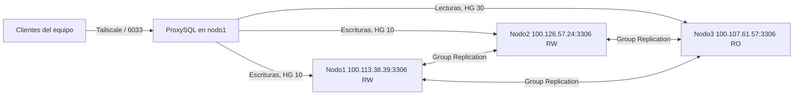

# Fase 1 — Preparación del entorno

## Objetivo

Dejar tres nodos MySQL independientes comunicados por Tailscale, replicando con
Group Replication, con nodo1 y nodo2 habilitados para escritura, nodo3 protegido
para lectura/contingencia y un proxy como punto único de entrada.

## Estado

**Implementación funcional: 100 %.** Los tres nodos están `ONLINE`, ProxySQL
enruta lecturas y escrituras y un cliente remoto autenticado fue validado desde
nodo3. Solo queda incorporar las capturas ya obtenidas al paquete del informe
final; esto no bloquea el inicio de la Fase 2.

| Requisito | Estado |
|---|---|
| Tres equipos independientes | Completo |
| Red privada | Completo |
| Group Replication | Completo |
| Nodo1 y nodo2 de lectura/escritura | Completo |
| Nodo3 de lectura/contingencia | Completo |
| Proxy o balanceador | Completo |
| Conectividad entre componentes | Completo, incluido cliente remoto |
| Tres nodos disponibles | Completo |

## Arquitectura validada

| Nodo | Responsable | Sistema | Dirección MySQL | Rol |
|---|---|---|---|---|
| Nodo1 | Byron | Ubuntu | `100.113.38.39:3306` | Lectura/escritura e inicialización |
| Nodo2 | Michael | Debian | `100.126.57.24:3306` | Lectura/escritura |
| Nodo3 | Carlos | Windows 11 | `100.107.61.57:3306` | Lectura/contingencia |

La IP `100.109.4.122` pertenece al host de Michael, pero MySQL nodo2 comparte
la red del sidecar Tailscale `100.126.57.24`. El equipo `100.75.156.76` no
forma parte del clúster.

Configuración común:

```text
MySQL:               8.4
Group UUID:          c395e8af-d580-4d6c-8574-a629027f1379
Communication stack: MYSQL
Puerto del grupo:    3306
Modo:                multi-primary
Bootstrap normal:    OFF
Inicio automático:   OFF
```

Diagrama de la arquitectura validada:



## 1. Comprobación de Tailscale

En cada equipo se obtiene la IP y se comprueban los pares:

```bash
tailscale ip -4
tailscale status
tailscale ping IP_DEL_OTRO_NODO
```

Desde nodo1 se validaron los servicios MySQL:

```bash
nc -vz -w 5 100.126.57.24 3306
nc -vz -w 5 100.107.61.57 3306
```

Resultado esperado en ambos casos:

```text
Connection ... 3306 ... succeeded
```

## 2. Comprobación local de cada MySQL

En cada carpeta de nodo:

```bash
docker compose ps
docker logs NOMBRE_CONTENEDOR --tail 30
```

Resultado esperado: contenedor `healthy`, MySQL escuchando en `3306` y ningún
error fatal en el log.

Valores obligatorios de cada servidor:

```sql
SELECT
  @@server_id,
  @@gtid_mode,
  @@group_replication_group_name,
  @@group_replication_communication_stack,
  @@group_replication_local_address,
  @@group_replication_group_seeds;
```

Se espera un `server_id` distinto (`1`, `2`, `3`), GTID `ON`, el mismo UUID,
pila `MYSQL` y las semillas siguientes:

```text
100.113.38.39:3306,100.126.57.24:3306,100.107.61.57:3306
```

## 3. Usuario y canal de recuperación

Los tres nodos usan `repl@%` con la misma credencial privada. La contraseña no
se escribe en Git ni en esta documentación.

Permisos comprobados:

```sql
SHOW GRANTS FOR 'repl'@'%';
```

Resultado requerido:

```text
REPLICATION SLAVE
BACKUP_ADMIN
CONNECTION_ADMIN
GROUP_REPLICATION_STREAM
```

Canal requerido:

```sql
SELECT CHANNEL_NAME, USER
FROM performance_schema.replication_connection_configuration
WHERE CHANNEL_NAME='group_replication_recovery';
```

Resultado:

```text
group_replication_recovery | repl
```

También se confirmó:

```sql
SELECT @@group_replication_recovery_get_public_key;
```

Resultado: `1`.

## 4. Formación segura del grupo

### Grupo completamente apagado

Antes de formar el grupo se comparan los GTID:

```bash
docker exec NOMBRE_CONTENEDOR sh -c 'mysql -uroot -p"$MYSQL_ROOT_PASSWORD" -N -e "SELECT @@global.gtid_executed;"'
```

Si nodo1 y nodo2 tienen el mismo GTID, nodo1 hace el único bootstrap:

```bash
docker exec mysql-node1 sh -c '
mysql -uroot -p"$MYSQL_ROOT_PASSWORD" -e "SET GLOBAL group_replication_bootstrap_group=ON;"
mysql -uroot -p"$MYSQL_ROOT_PASSWORD" -e "START GROUP_REPLICATION;"
resultado=$?
mysql -uroot -p"$MYSQL_ROOT_PASSWORD" -e "SET GLOBAL group_replication_bootstrap_group=OFF;"
mysql -uroot -p"$MYSQL_ROOT_PASSWORD" -e "
SELECT @@global.group_replication_bootstrap_group AS bootstrap;
SELECT MEMBER_HOST, MEMBER_PORT, MEMBER_STATE, MEMBER_ROLE
FROM performance_schema.replication_group_members;
"
exit "$resultado"
'
```

Resultado seguro: `bootstrap = 0` y nodo1 `ONLINE`.

### Unión de los demás nodos

Cuando ya existe un miembro `ONLINE`, los demás se unen sin bootstrap:

```sql
START GROUP_REPLICATION;

SELECT MEMBER_HOST, MEMBER_PORT, MEMBER_STATE, MEMBER_ROLE
FROM performance_schema.replication_group_members;
```

Un nodo puede aparecer brevemente como `RECOVERING`. Se espera hasta que quede
`ONLINE`; no se repite `START GROUP_REPLICATION`.

## 5. Estado final comprobado

```text
100.113.38.39  3306  ONLINE  PRIMARY
100.126.57.24  3306  ONLINE  PRIMARY
100.107.61.57  3306  ONLINE  PRIMARY
```

Los tres aparecen `PRIMARY` porque Group Replication utiliza modo
multi-primary.

## 6. Protección de nodo3

Después de unir nodo3 se activa su protección:

```sql
SET GLOBAL super_read_only=ON;
SELECT @@global.read_only, @@global.super_read_only;
```

Resultado validado:

```text
read_only = 1
super_read_only = 1
```

La escritura directa de prueba fue rechazada correctamente:

```text
ERROR 1290: The MySQL server is running with the --super-read-only option
```

La replicación puede seguir aplicando cambios en nodo3. Esta protección debe
comprobarse nuevamente después de cada reinicio o reincorporación.

## 7. Recuperación conocida de nodo2

Nodo2 ejecuta MySQL en el espacio de red de `tailscale-node2`. Su identidad se
conserva en el volumen `tailscale_node2_state`.

Diagnóstico:

```bash
docker exec tailscale-node2 tailscale status
docker logs tailscale-node2 --since 10m --tail 120
```

Solo si el log confirma clave inválida, expirada o sesión perdida se actualiza
`TS_AUTHKEY` en el `.env` privado y se recrean los servicios sin borrar datos:

```bash
docker compose up -d --force-recreate tailscale-node2 mysql-node2
docker exec tailscale-node2 tailscale ip -4
docker compose ps
```

Se espera recuperar `100.126.57.24` y `mysql-node2` en estado `healthy`. Si el
grupo continúa vivo, nodo2 regresa mediante `START GROUP_REPLICATION`, nunca
con bootstrap.

## 8. Acciones prohibidas

- No ejecutar `docker compose down -v`.
- No ejecutar `docker volume rm`.
- No borrar `data/*`.
- No activar bootstrap en más de un nodo.
- No hacer bootstrap si todavía existe un grupo `ONLINE`.
- No guardar contraseñas o claves de Tailscale en Markdown o Git.
- No ejecutar pruebas CRUD o de fallos sin registrar estado inicial y evidencia.

## 9. Recuperación después de un apagado de nodo1

El apagado inesperado del equipo no borró configuraciones ni volúmenes. Docker
reinició `mysql-node1` y `proxysql-db2` automáticamente y ambos quedaron
saludables. Como `group_replication_start_on_boot=OFF`, MySQL arrancó fuera del
grupo, mientras nodo2 y nodo3 conservaron el grupo activo.

Antes de actuar se comprobó:

```text
nodo1: OFFLINE
nodo2: ONLINE
nodo3: ONLINE
GTID de los tres nodos: idéntico
bootstrap en nodo1: 0
```

Al existir todavía miembros `ONLINE`, no se hizo bootstrap. Nodo1 se
reincorporó únicamente con:

```sql
START GROUP_REPLICATION;
```

Resultado validado después de la reincorporación:

```text
100.113.38.39  3306  ONLINE  PRIMARY
100.107.61.57  3306  ONLINE  PRIMARY
100.126.57.24  3306  ONLINE  PRIMARY
```

Procedimiento corto para futuros reinicios:

1. Comprobar `docker compose ps` y `tailscale status`.
2. Consultar `replication_group_members` en los tres nodos.
3. Si existe al menos un miembro `ONLINE`, ejecutar solamente
   `START GROUP_REPLICATION` en el nodo que esté `OFFLINE`.
4. Usar bootstrap en un único nodo solamente cuando todo el grupo esté apagado
   y después de comparar los GTID.

## 10. Pendiente para cerrar la fase al 100 %

Preparación ya realizada:

- Los puertos `6032` y `6033` se comprobaron libres en nodo1.
- Se creó `proxy/docker-compose.yml` con ProxySQL `3.0.11-debian`.
- Administración limitada a `127.0.0.1:6032`.
- Entrada de clientes planificada en `100.113.38.39:6033`.
- Se agregó volumen persistente y plantilla sin secretos.
- Se creó la configuración privada, Git confirmó que está ignorada y
  `docker compose config --quiet` validó correctamente el Compose.

Pendiente de ejecución:

### Primer arranque de ProxySQL

Desde la carpeta `proxy/` se utiliza:

```bash
docker compose up -d
```

Este comando:

- descarga `proxysql/proxysql:3.0.11-debian` si la imagen todavía no existe;
- inicia únicamente el contenedor `proxysql-db2`;
- crea o reutiliza el volumen persistente `proxy_proxysql_data`;
- monta la configuración privada como solo lectura;
- no reinicia, recrea ni modifica los contenedores MySQL de los tres nodos.

El resultado esperado es `Container proxysql-db2 Started`. Después se deben
revisar el estado, el healthcheck, los logs y los puertos antes de registrar
servidores o usuarios.

Resultado obtenido: la imagen se descargó correctamente, se creó el volumen
`proxy_proxysql_data` y el contenedor `proxysql-db2` inició sin recrear ningún
MySQL. El arranque inicial queda pendiente de validar mediante `docker compose
ps`, logs y listeners.

La validación mostró `proxysql-db2` en estado `healthy` y los puertos locales
`6032` y `6033` accesibles. El primer healthcheck abría conexiones TCP sin
autenticación y generaba avisos repetidos `user 'unknown'`; no era un fallo del
proxy. Se corrigió para comprobar el socket en escucha mediante
`/proc/net/tcp`, sin crear sesiones MySQL falsas, y se recreó únicamente el
contenedor del proxy para aplicar el ajuste.

Después de recrearlo, el contenedor volvió a `healthy` y los logs recientes ya
no mostraron sesiones falsas. Se preparó además una plantilla SQL ignorando su
copia privada para crear `proxysql_monitor` y `app_user` con privilegios
mínimos, sin utilizar `root` a través del proxy.

La copia privada `proxy/sql/mysql-users.sql` quedó ignorada por Git y se
comprobó, sin mostrar su contenido, que los dos marcadores de contraseña fueron
reemplazados. Está lista para ejecutarse una sola vez en nodo1 y replicarse al
grupo.

La plantilla se ejecutó en nodo1 y Group Replication registró las cuentas:

```text
proxysql_monitor: REPLICATION CLIENT sobre *.*
app_user:         SELECT, INSERT, UPDATE, DELETE sobre data_bugs.*
```

La ausencia de una fila separada para `USAGE` en el monitor es normal: `USAGE`
representa que la cuenta puede autenticarse y no agrega un privilegio efectivo.
Se preparó `proxy/sql/proxysql-admin.sql.example` para registrar hostgroups,
servidores, monitor, usuario y reglas sin guardar secretos en Git.

Durante la preparación apareció una credencial en el editor de una plantilla
`.example`; se rotó inmediatamente. La copia guardada de las plantillas fue
auditada y conserva solo marcadores. Las dos copias privadas están ignoradas,
sus credenciales coinciden y la autenticación local de `proxysql_monitor` y
`app_user` devolvió `OK` sin exponer los valores.

El primer envío de `proxysql-admin.sql` terminó en la línea 1 con `ERROR 1045
ProxySQL Admin Error: not an error`. Un `SELECT 1` y un `UPDATE` sin cambios
confirmaron que la autenticación y la interfaz administrativa funcionaban. La
causa se aisló al encabezado de comentarios `--` del archivo por lotes; se
retiró de la plantilla. Como la contraseña administrativa apareció en el
editor, debe rotarse antes de reintentar, sin borrar el volumen ni modificar
los MySQL.

La configuración de hostgroups sí se cargó en runtime y disco. El primer health
check de Group Replication movió preventivamente los tres backends al hostgroup
offline `40` con `viable_candidate=NO`. El log de monitor identificó la causa:

```text
SELECT command denied ... for table 'replication_group_members'
```

El clúster continuó `ONLINE`; el bloqueo ocurrió solo dentro del proxy. Para
MySQL 8.4, el monitor necesita además `SELECT` sobre
`performance_schema.replication_group_members` y
`performance_schema.replication_group_member_stats`. Se preparó un ajuste
mínimo para conceder únicamente esas lecturas.

Después de aplicar los permisos, ProxySQL reclasificó automáticamente el
clúster sin reiniciar:

```text
HG 10  nodo1  ONLINE  escritor
HG 10  nodo2  ONLINE  escritor
HG 30  nodo1  ONLINE  lector
HG 30  nodo2  ONLINE  lector
HG 30  nodo3  ONLINE  lector / contingencia
```

Los health checks confirmaron para los tres `viable_candidate=YES`, retraso
`0` y `error=NULL`. Nodo1/nodo2 reportaron `read_only=NO` y nodo3
`read_only=YES`, validando la distribución automática de roles.

La conexión de aplicación por `127.0.0.1:6033` también quedó comprobada. Un
`SELECT` normal fue dirigido a nodo3:

```text
backend=100.107.61.57  server_id=3  read_only=1  super_read_only=1
```

Después, una transacción con `SELECT ... FOR UPDATE` fue dirigida a nodo2 y
terminó en `ROLLBACK`, sin cambiar datos:

```text
backend_escritor=100.126.57.24  server_id=2  read_only=0
```

Esto valida las reglas 110 (lecturas al HG 30) y 100 (bloqueos/escrituras al
HG 10).

La conectividad externa también se comprobó desde nodo3/Windows hacia el proxy:

```text
Origen:            100.107.61.57
Destino:           100.113.38.39:6033
Interfaz:          Tailscale
TcpTestSucceeded:  True
```

Esto confirma que el listener de clientes no está limitado a localhost y es
alcanzable desde otro host.

La autenticación remota también se validó desde nodo3/Windows utilizando
`app_user` por el puerto `6033`. La consulta no modificó datos y ProxySQL la
dirigió correctamente al lector de contingencia:

```text
backend          server_id  read_only
100.107.61.57    3          1
```

La rotación administrativa se envió correctamente mediante un archivo privado
ignorado. ProxySQL guardó el cambio en disco, lo cargó en runtime y la misma
credencial quedó sincronizada en `proxy/conf/proxysql.cnf`. El acceso
administrativo y los hostgroups se validaron después de la rotación.

Durante la preparación administrativa se detectó una credencial visible en el
editor/chat. Las plantillas guardadas en disco permanecieron limpias y con sus
marcadores. Las credenciales afectadas se rotaron en las copias privadas y en
los servicios correspondientes; no se registra ningún valor secreto en esta
bitácora.

Durante la preparación se detectó que una credencial real había sido pegada
por error en `mysql-users.sql.example`, archivo destinado a Git. Se detuvo la
configuración antes de registrar ProxySQL, se restauró la plantilla con
marcadores y se verificó que ningún archivo `.example` conservara secretos.
Como medida preventiva se rotaron tanto la clave del monitor como la del
usuario de aplicación antes de continuar.

Después de la prueba remota se detectó nuevamente una credencial visible en el
editor. Se generaron credenciales nuevas sin imprimirlas y se sincronizaron en
MySQL, ProxySQL y los archivos privados ignorados. Las conexiones del monitor
y de `app_user` se validaron después de la rotación.

Tareas técnicas completadas:

1. ProxySQL instalado como punto de entrada.
2. Usuarios separados de monitor y aplicación creados.
3. Nodo1 y nodo2 registrados como escritores y nodo3 como lector.
4. Health checks y reglas de lectura/escritura configurados.
5. Conexión local y remota por el puerto del proxy validadas.
6. Estado de los tres servidores comprobado desde ProxySQL.
7. Diagrama con IP, puerto y flujo de conexiones incorporado.

La organización de las capturas se realizará en paralelo con el informe final.

## Evidencias que se deben guardar

- `tailscale status` mostrando los tres equipos.
- Puertos `3306` accesibles entre los nodos.
- `docker compose ps` de cada equipo.
- Consulta con los tres miembros `ONLINE`.
- Consulta `read_only=1` y `super_read_only=1` de nodo3.
- Error 1290 al intentar escritura directa en nodo3.
- Servidores y hostgroups activos en ProxySQL.
- Consulta realizada por el puerto `6033` del proxy.
- Diagrama de arquitectura.

## Criterio de cierre

La implementación de la Fase 1 está completa: el cliente remoto se conectó a
ProxySQL, el proxy muestra destinos saludables, los tres MySQL están `ONLINE`
y nodo3 rechaza escrituras directas. Antes de entregar, las capturas enumeradas
deben copiarse al paquete del informe final.
